# Como Extrair Atributos de Blocos?

Informações:

* Este tutorial é aplicável tanto ao AutoCAD quanto ao AutoCAD LT;
* Cada etapa incluirá uma imagem explicativa.

## Passo 01

Digite o comando **"EXTRATRIB / ATTEXT"** na barra de comando e pressione **"Enter"**, como demonstrado na Imagem 01.

<figure>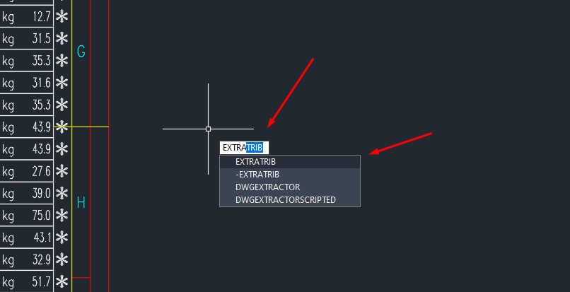<figcaption><p>Imagem01</p></figcaption></figure>

## Passo 02

Ao acessar a aba denominada **"Extração de Atributos"**, no canto superior esquerdo dessa aba selecione a opção **"Arquivo delimitado por vírgulas (CDF)"**, como demonstrado na Imagem 02.

<figure>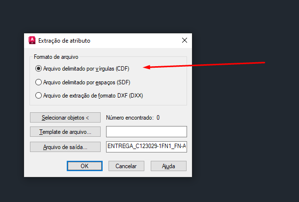<figcaption><p>Imagem 02</p></figcaption></figure>

## Passo 03

Clique no botão **"Selecionar objetos"**, localizado à esquerda, na parte central, como desmonstrado na Imagem 03.

<figure>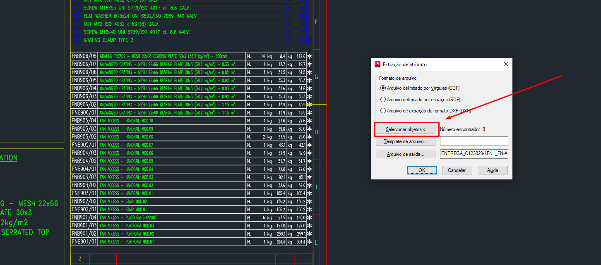<figcaption><p>Imagem 03</p></figcaption></figure>

## Passo 04

Selecione os Blocos Brancos, Bloco de Parafuso ou Bloco de Material que deseja como mostrado na Imagem 04.

<figure>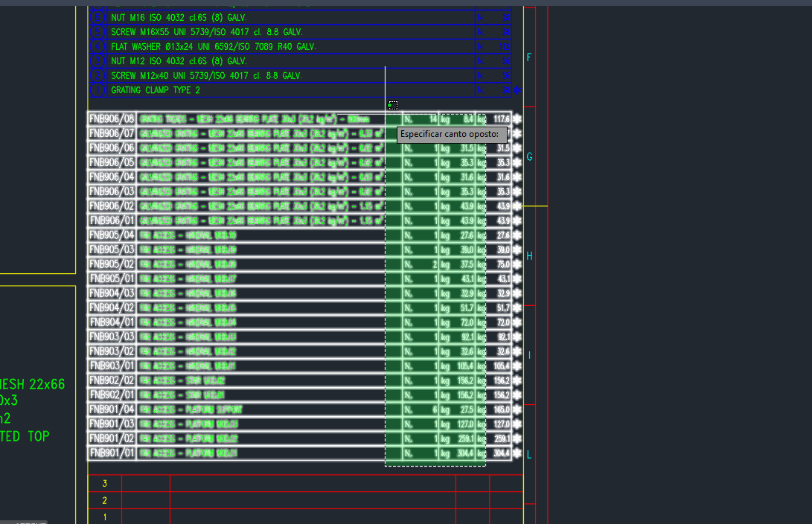<figcaption><p>Imagem 04</p></figcaption></figure>

## Passo 05

Clique no botão **"Template de arquivo"**, localizado à esquerda, na parte central, como desmonstrado na Imagem 05.

<figure>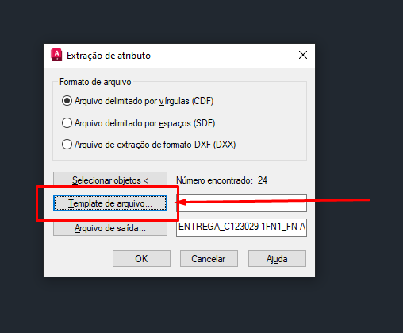<figcaption><p>Imagem 05</p></figcaption></figure>

## Passo 06

Irá abrir a aba **"Template de Arquivo"**, onde você deverá inserir o link fornecido abaixo no campo **"Nome do arquivo"** e clicar no botão **"Abrir"**, como desmonstrado na Imagem 06.

```
L:\Drives compartilhados\EMB_ENGENHARIA_BIBLIOTECA\PADRÕES PROGRAMAS\AUTOCAD\EXTRAÇÃO
```

<figure>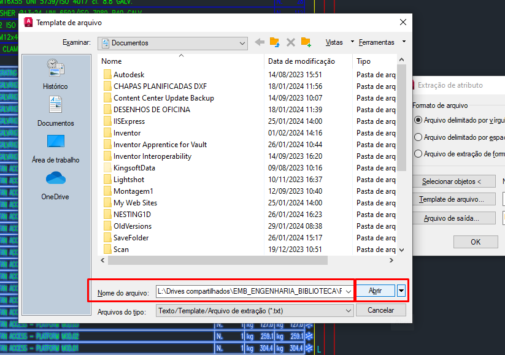<figcaption><p>Imagem 06</p></figcaption></figure>

## Passo 07

Você encontrará quatro templates para extração. Selecione o template desejado e clique no botão **"Abrir"**, como desmonstrado na Imagem 07

Abaixo, você verá qual configuração de extração se aplica a qual bloco e os atributos que cada configuração extrai.

| Template de Extração            | Bloco que aplica           | Atributos Extraído                                       |
| ------------------------------- | -------------------------- | -------------------------------------------------------- |
| CONFIG EXTRAÇÃO                 | Bloco Branco               | Tag, Quantidade, Peso Unitário e Peso Total              |
| CONFIG EXTRAÇÃO DESCRIÇÃO-PEÇAS | Bloco Branco               | Tag, Descrição, Quantidade, Peso Unitário e Peso Total   |
| CONFIG EXTRAÇÃO - PARAFUSO      | Bloco Azul / Bloco Amarelo | Posição, Código, Descrição e Quantidade                  |
| CONFIG EXTRAÇÃO - MATERIAL      | Bloco de Material          | Posição, Descrição, Unidade, Quantidade, Material e Peso |

<figure>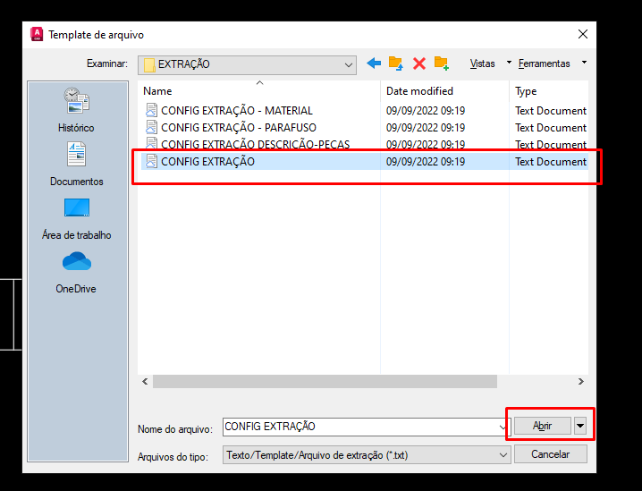<figcaption><p>Imagem 07</p></figcaption></figure>

## Passo 08

Clique no botão **"Arquivo de saída"**, localizado à esquerda na parte central, como desmonstrado na Imagem 08.

<figure>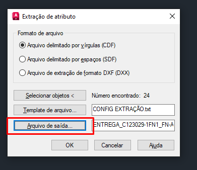<figcaption><p>Imagem 08</p></figcaption></figure>

## Passo 09

Uma aba chamada **"Arquivo de Saída"** será aberta. Clique na opção **"Área de Trabalho"** para definir o local do arquivo de saída e, em seguida, clique em **"Salvar"**, como desmonstrado na Imagem 09.

Se você não definir um caminho de saída, o arquivo será salvo na mesma pasta onde o desenho está localizado

<figure>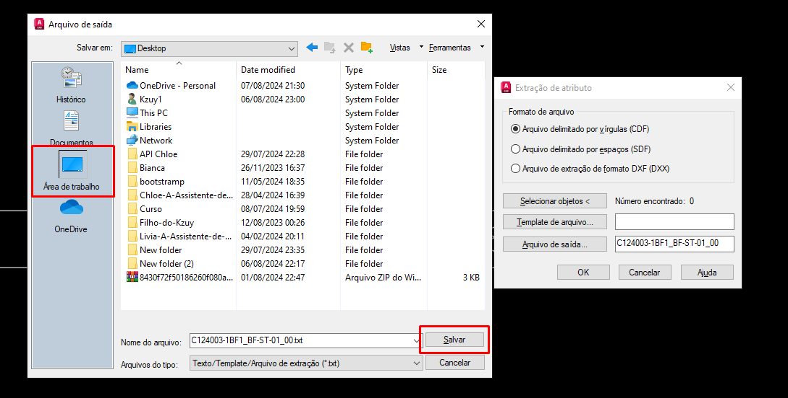<figcaption><p>Imagem 09</p></figcaption></figure>

## Passo 10

Clique no botão **"Ok"**, localizado na parte inferior central, para gerar um arquivo de texto contendo as informações dos blocos, conforme demonstrado na Imagem 10.

<figure>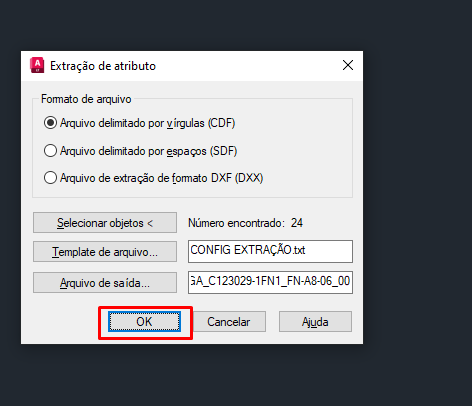<figcaption><p>Imagem 10</p></figcaption></figure>

## Passo 11

No **"Explorador de arquivos"** insira o link fornecido abaixo, conforme demostrado na Imagem 11.

```
L:\Drives compartilhados\EMB_ENGENHARIA_BIBLIOTECA\PADRÕES PROGRAMAS\AUTOCAD\EXTRAÇÃO
```

<figure>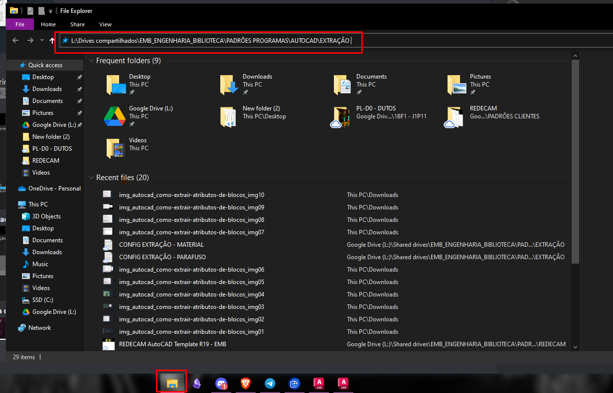<figcaption><p>Imagem 11</p></figcaption></figure>

## Passo 12

Será redirecionado para uma pasta  com **"Planilhas para Extração"**. Selecione a planilha desejada abra uma, conforme demostrado na Imagem 11.

<figure>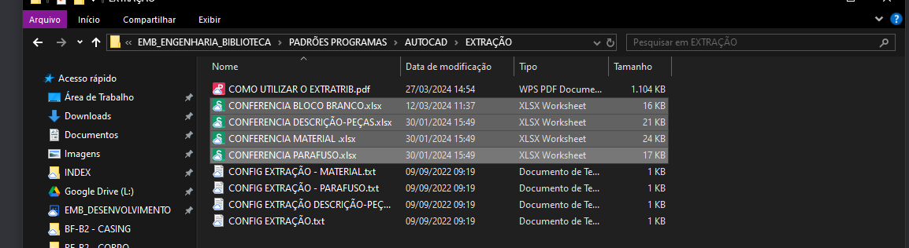<figcaption><p>Imagem 12</p></figcaption></figure>

## Passo 13

Abra o arquivo de texto gerado no [Passo 10](como-extrair-atributos-de-blocos.md#passo-10) que deve estar na Área de Trabalho, selecione todo o conteúdo com **"CTRL+A"** e copie-o com **"CTRL+C"**, conforme demostrado na Imagem 13.

<figure><figcaption><p>Imagem 13</p></figcaption></figure>

## Passo 14

Cole os dados na célula **"A2"** da planilha para garantir que você tenha todas as informações dos blocos.

<figure>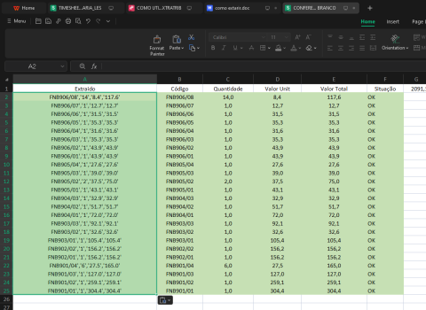<figcaption><p>Imagem 14</p></figcaption></figure>
