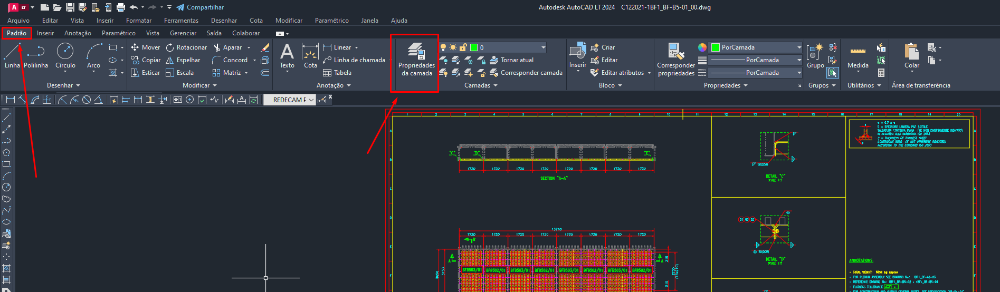
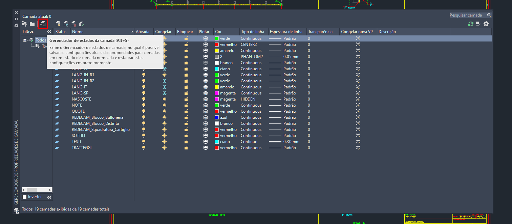
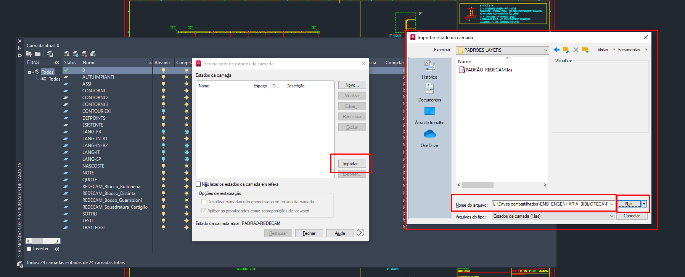
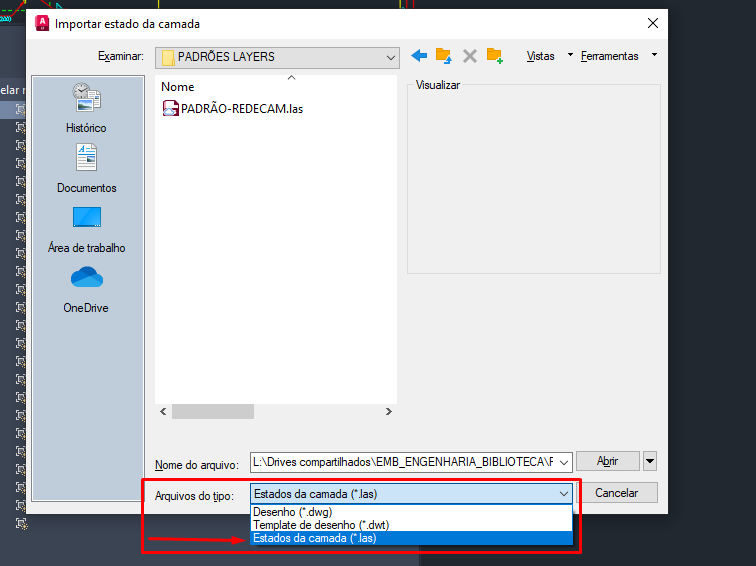
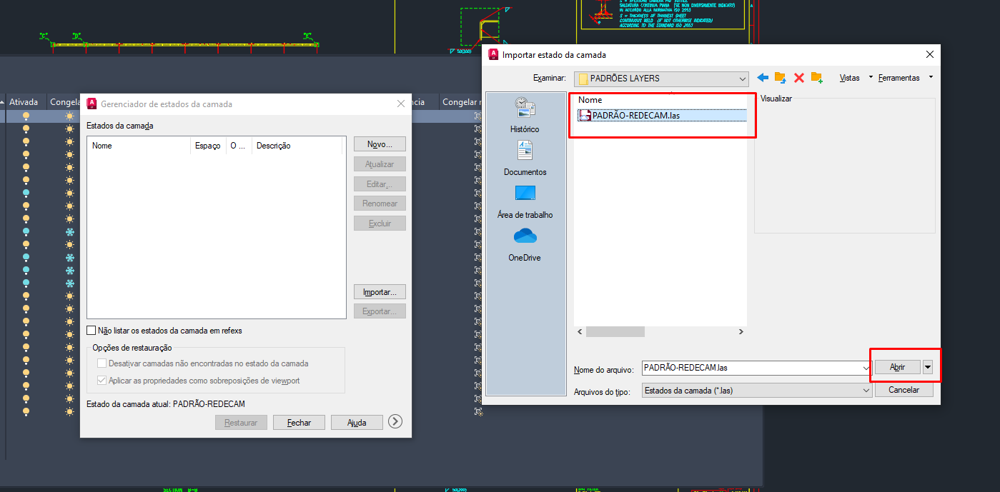
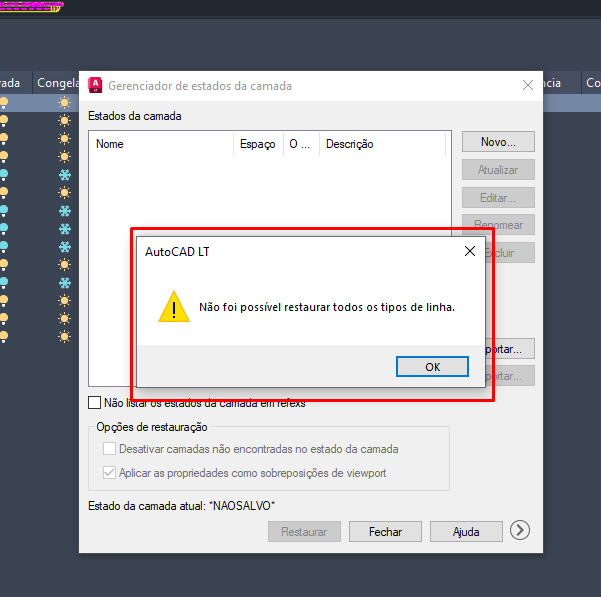
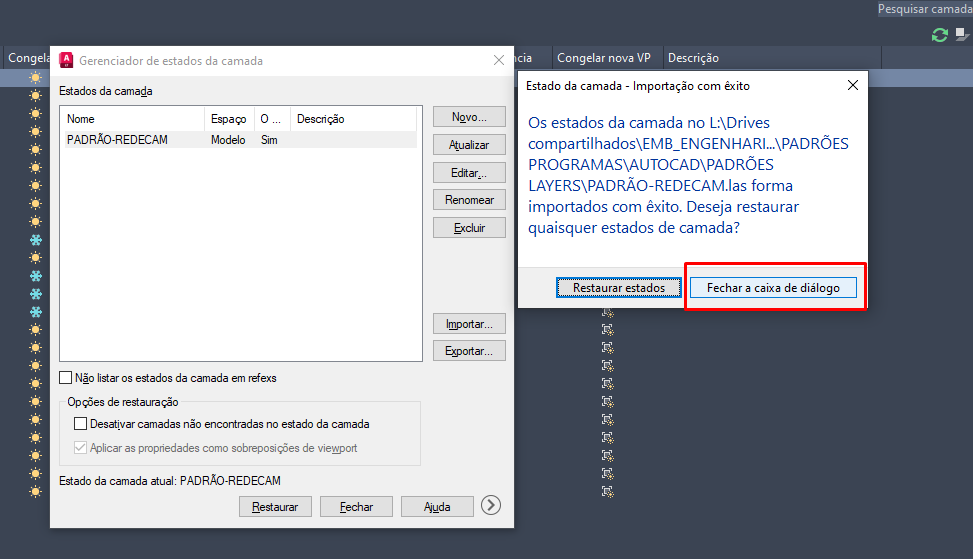
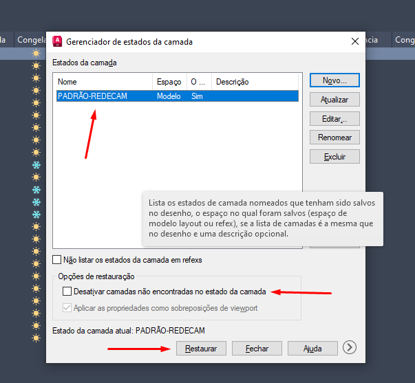
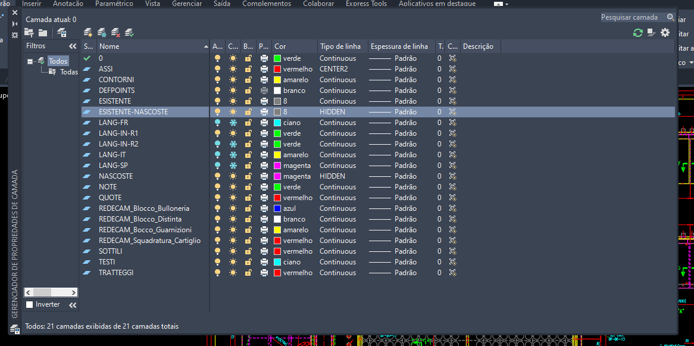
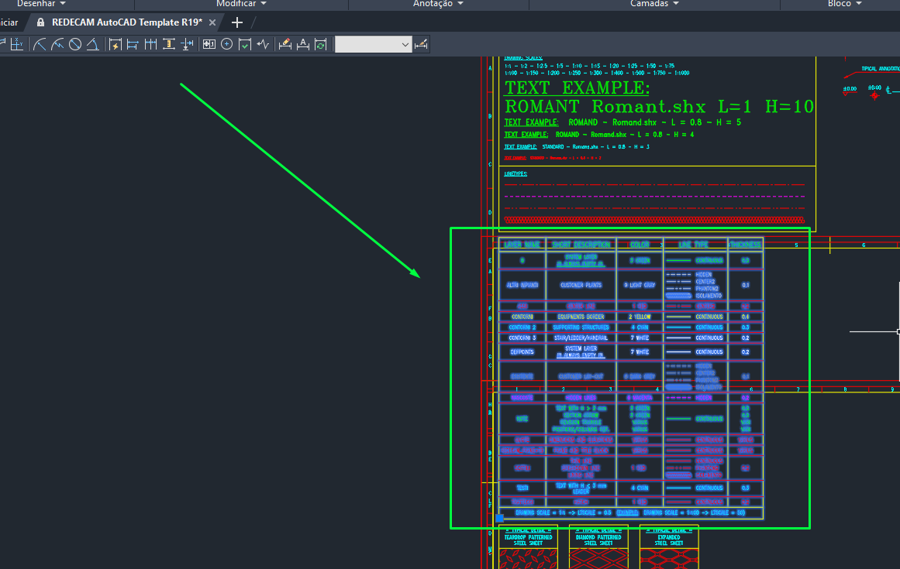

# Configurando Layers

## Informações:

* Este tutorial é aplicável tanto ao AutoCAD quanto ao AutoCAD LT;
* Cada etapa incluirá uma imagem explicativa.

## Passo 01

Vá na aba **`Padrão`** no canto superior esquerdo. E na parte superior centro irá encontrar a opção **`Propriedades da Camada`**.

<figure><figcaption><p>Imagem 01</p></figcaption></figure>

## Passo 02

Ao abrir a aba **`Propriedades de Camada`**, localize o **`Gerenciador de Estados da Camada`** no canto superior direito da aba. Poderá acessá-lo clicando ou apertando **`ALT + S`**.

<figure><figcaption><p>Imagem 02</p></figcaption></figure>

## Passo 03

Uma nova aba intitulada **`Gerenciador de Estados da Camada`** será aberta, exibindo todos os estados das camadas do desenho. Caso exista um estado previamente criado, você pode selecioná-lo e excluí-lo clicando no botão **`Excluir`** localizado no canto direito da aba.

<figure><figcaption><p>Imagem 03</p></figcaption></figure>

## Passo 04

Clique no botão **`Importar`**, que está localizado na direita. Isso abrirá uma nova aba chamada **`Importar estado de modelo`**, onde você deverá inserir o link fornecido abaixo no campo **`Nome do arquivo`**, e ir no botão **`Abrir`**.


```
L:\Drives compartilhados\EMB_ENGENHARIA_BIBLIOTECA\PADRÕES PROGRAMAS\AUTOCAD\PADRÕES LAYERS
```


<figure><figcaption><p>Imagem 04</p></figcaption></figure>

## Passo 05

Ainda na aba **`Importar estado de modelo`**, no campo **`Arquivos do tipo`**, selecione a opção de **`(*.las)`**.

<figure><figcaption><p>Imagem 05</p></figcaption></figure>

## Passo 06

Selecione o arquivo **`PADRÃO-REDECAM`**, e clique no botão **`Abrir`**.

<figure><figcaption><p>Imagem 06</p></figcaption></figure>

## Passo 07

Nesse passo, duas situações podem ocorrer. Se aparecer a mensagem **`Não foi possível restaurar todos os tipos de linha`**, como mostrado na Imagem 07, será necessário ir para a seção de [Erro 01](configurando-layers.md#erro-01). Caso seja exibido o aviso **`Estado da camada - Importação com êxito`**, clique no botão **`Fechar a caixa de diálogo`**, como demonstrado na Imagem 08.

<figure><figcaption><p>Imagem 07</p></figcaption></figure>

<figure><figcaption><p>Imagem 08</p></figcaption></figure>

## Passo 08

Voltando a aba intitulada **`Gerenciador de Estados da Camada`**, selecione o estado de camada **`PADRÃO-REDECAM`**, e na parte de baixo em **`Opções de restauração`** deixe desmarcado a opção **`Desativar camadas não encontradas no estado da camada`**, e clique no botão **`Restaurar`** na parte inferior direita.

<figure><figcaption><p>Imagem 09</p></figcaption></figure>

## Passo 09

Ao fechar a aba do **`Gerenciador de Estados da Camada`**, podera ver as **`Propriedades de Camada`**, com suas devidas configurações, como a Imagem 10.

<figure><figcaption><p>Imagem 10</p></figcaption></figure>

## Erro 01

Abra o **`REDECAM AutoCAD Template`**, disponível no link abaixo, e copie o `Bloco de Camada` (Na Imagem 11, você pode ver a localização do bloco). Mova-o para dentro do desenho e, em seguida, reinicie o processo desde o início.

```
L:\Drives compartilhados\EMB_ENGENHARIA_BIBLIOTECA\PADRÕES CLIENTES\REDECAM\REDECAM AutoCAD Template R19.dwg
```

<figure><figcaption><p>Imagem 11</p></figcaption></figure>
