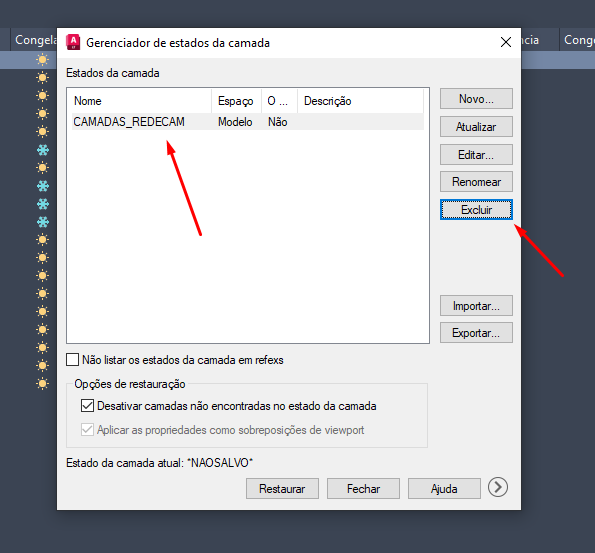

# Configurando Layers

## Informações:

* Este tutorial é aplicável tanto ao AutoCAD quanto ao AutoCAD LT;
* Cada etapa incluirá uma imagem explicativa.

## Passo 1

Vá na aba `Padrão / Home` no canto superior esquerdo. E na parte superior centro irá encontrar a opção `Propriedades da Camada / Layer Properties`.

<figure><figcaption><p>Imagem 01</p></figcaption></figure>

## Passo 2

Ao abrir a aba `Propriedades de Camada / Layer Properties`, localize o `Gerenciador de Estados da Camada / Layer States Manager` no canto superior direito da aba. Poderá acessá-lo clicando ou apertando `ALT + S`.

<figure><figcaption><p>Imagem 02</p></figcaption></figure>

## Passo 3

Uma nova aba intitulada `Gerenciador de Estados da Camada / Layer States Manager` será aberta, exibindo todos os estados das camadas do desenho. Caso exista um estado previamente criado, você pode selecioná-lo e excluí-lo clicando no botão `Excluir / Delete` localizado no canto direito da aba.

<figure><figcaption><p>Imagem 03</p></figcaption></figure>

## Passo 4

Clique no botão `Importar / Import`, que está localizado na direita. Isso abrirá uma nova aba chamada `Importar estado de modelo / Import layer state`, onde você deverá inserir o link fornecido abaixo no campo `Nome do arquivo / File Name`, e ir no botão `Abrir / Open`.


```
L:\Drives compartilhados\EMB_ENGENHARIA_BIBLIOTECA\PADRÕES PROGRAMAS\AUTOCAD\PADRÕES LAYERS
```

