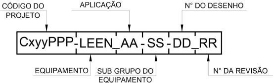
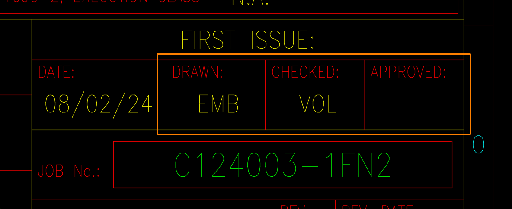

# 🚨 Erros de Desenho

***

## Error ED01

O nome arquivo não está separado corretamente.

Os códigos de desenho são separados  por traços (-) e sublinhados (\_), conforme demonstrado na Imagem 01.

<figure><figcaption>
Imagem 01
</figcaption></figure>

### Solução

Renomeie o arquivo seguindo a segmentação correta.

***

## Error ED02

Bloco de Legenda está com código errado.

Na Imagem 02, o Bloco de Legenda apresenta um código diferente do que está no Nome do Arquivo. Os códigos mostrados são 1FN2\_FN-A8-01, mas o correto é 1FN3\_FN-A8-01.

<figure><figcaption>
Imagem 02
</figcaption></figure>

### Solução

Utilize o Lisp `AtualizarCodigoLegenda` para atualizar os códigos do Bloco de Legenda.

***

## Error ED03

Bloco de Legenda está com escala errado.

O Bloco de Legenda apresenta uma discrepância entre a escala exibida e a escala do atributo do bloco, conforme demonstrado na Imagem 03.

<figure><figcaption>
Imagem 03
</figcaption></figure>

### Solução

Ajuste a escala para a escala indicada nos atributos de escala do Bloco.

***

## Error 04

O Bloco de Legenda geralmente fica com :&#x20;

* DRAW: EMB&#x20;
* CHECKED: VOL&#x20;
* APPROVED: Sem nada ou em Branco

<figure><figcaption>
Imagem 04
</figcaption></figure>

### Solução

Coloque os atributos indicados acima.

***

## Error ED06

LTScale está diferente da metade da Escala do Desenho.

O LTScale deve ser metade da escala, por exemplo Escala - 1:100 LTScale - 50.

Na Imagem 05 temos um exemplo aplicado do LT

<figure><figcaption>
Imagem 05
</figcaption></figure>

