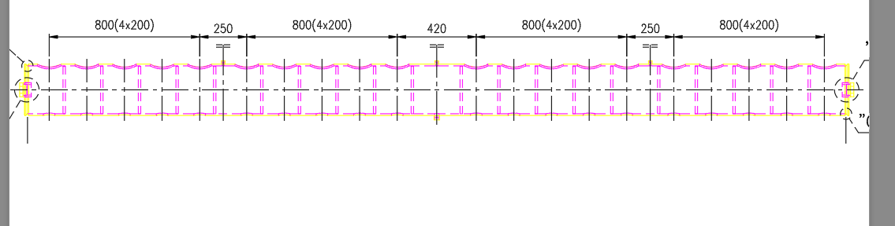
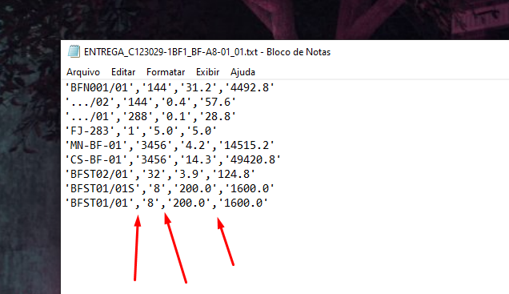
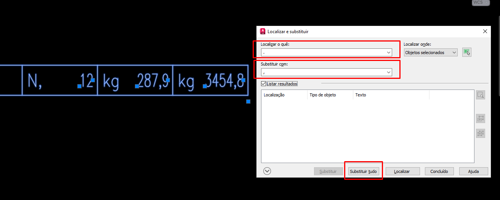

# 🚨 Erros de Desenho

Error ED01

O nome arquivo não está separado corretamente.

Os códigos de desenho são separados  por traços (-) e sublinhados (\_), conforme demonstrado na Imagem 01.

<figure><figcaption>
Imagem 01
</figcaption></figure>

### Solução

Renomeie o arquivo seguindo a segmentação correta.

***

## Error ED02

Bloco de Legenda está com código errado.

Na Imagem 02, o Bloco de Legenda apresenta um código diferente do que está no Nome do Arquivo. Os códigos mostrados são 1FN2\_FN-A8-01, mas o correto é 1FN3\_FN-A8-01.

<figure><figcaption>
Imagem 02
</figcaption></figure>

### Solução

Utilize o Lisp [AtualizarCodigoLegenda](../autocad/lisp/atualizacodigolegenda.md) para atualizar os códigos do Bloco de Legenda.

***

## Error ED03

Bloco de Legenda está com escala errado.

O Bloco de Legenda apresenta uma discrepância entre a escala exibida e a escala do atributo do bloco, conforme demonstrado na Imagem 03.

<figure><figcaption>
Imagem 03
</figcaption></figure>

### Solução

Ajuste a escala para a escala indicada nos atributos de escala do Bloco.

***

## Error 04

Bloco de Legenda está com DRAW, CHECKED ou APPROVED errado.

O Bloco de Legenda geralmente fica com :&#x20;

* DRAW: EMB&#x20;
* CHECKED: VOL&#x20;
* APPROVED: Sem nada ou em Branco

<figure><figcaption>
Imagem 04
</figcaption></figure>

### Solução

Coloque os atributos indicados acima.

***

## Error ED06

LTScale está diferente da metade da Escala do Desenho.

Ocorre quando a configuração de LTScale (escala de tipo de linha) não está de acordo com a escala do desenho.

[O que é LTScale é como ele funciona?](../autocad/ltscale.md)

### Solução

Ajustar o valor do LTScale para ser a metade da escala do desenho, conforme demonstrado na Imagem 05.

<figure><figcaption>
Imagem 05
</figcaption></figure>

***

## Error ED07

Layer **`CONTOUR EXI`** está presente no Desenho.

Na versão R16, existia uma camada chamada **`CONTOUR EXI`** utilizada para indicar peças existentes. A partir da versão R19, essa camada foi substituída pela camada **`ESISTENTE`** (Existente em Italiano).

### Solução 01

Digite o comando **`Eliminar / Purge`**, existe uma aba chamada **`Itens que não podem ser eliminados`**. Dentro dessa aba, há uma árvore de nós onde podemos expandir o nó  de **`Camadas`** para mostrar todas as camadas / layers presentes no desenho. Ao selecionar a camada **`CONTOUR EXI`**, serão exibidos todos os objetos associados a ela. Selecione esses objetos e mude para a camada **`ESISTENTE`**. Conforme demonstrado na Imagem 06.

<figure><figcaption>
Imagem 06
</figcaption></figure>

### Solução 02

Seguindo a [solução anterior](erros-de-desenho.md#solucao-01), caso você tenha algum objeto em **`CONTOUR EXI`** dentro de um bloco, você pode copiar o nome do arquivo e ao digitar o comando **`INSERIR / INSERT`** abrirá uma janela mostrando todos os blocos. Selecione a aba **`Desenho Atual`** e cole o nome do bloco no campo de pesquisa que foi copiado anteriormente. Ao selecionar o bloco, é possível adicioná-lo ao desenho e ajustar o bloco para remover a layer **`CONTOUR EXI`**, conforme mostrado na Imagem 07.

<figure><figcaption>
Imagem 07
</figcaption></figure>

***

## Error ED08

Linha de Chamada não está na camada QUOTE.

A Linha de Chamada diferente das Cotas porque, ao contrário destas, não é automaticamente direcionada para a camada **`QUOTE`**. Em vez disso, ela é alocada na camada selecionada da Paleta de Camadas, que por padrão é a **`Camada 0`**, mas pode também ser a camada **`ASSI`** ou outras. Portanto, é necessário realizar a troca para garantir que a Linha de Chamada esteja na cama **`QUOTE`**.&#x20;

### Solução

Digite o comando **`Eliminar / Purge`**, existe uma aba chamada **`Itens que não podem ser eliminados`**. Dentro dessa aba, há uma árvore de nós onde podemos expandir o nó  de **`Estilos de cota`** para mostrar todas os estilo de cota presentes no desenho. Ao selecionar a camada qualquer estilo, serão exibidos todos os objetos associados a ela. Selecione as Linhas de Chamadas que estão fora da camada **`QUOTE`**.  Conforme demonstrado na Imagem 08.

<figure><figcaption>
Imagem 08
</figcaption></figure>

***

## Error ED09

Deve ter apenas um Bloco de Legenda no mesmo desenho.

Não enviar desenhos como indicado na Imagem 09, a Chloe utiliza os Blocos de Legenda para determinar certas informações para realizar outras verificações.

<figure><figcaption>
Imagem 09
</figcaption></figure>

### Solução

Dividir o desenho em dois arquivos dwg.

***

## Error ED10

Bloco de Revisão 0 está com a Data diferente da Data de Emissão no Bloco de Legenda.

O Bloco de Revisão 0 ou Bloco de Revisão escrito **`FIRST ISSUE / PRIMEIRA EMISSÃO`** deve ter a mesma Data de Emissão que o Bloco de Legenda como indicado na Imagem 10.

<figure><figcaption>
Imagem 10
</figcaption></figure>

### Solução

Colocar a mesma data no Bloco de Revisão 0 e no Bloco de Legenda.

***

## Error ED11

Bloco de Revisão atual está diferente da Data de Revisão no Bloco de Legenda.

O Bloco de Revisão atual deve corresponder à Data de Revisão do Bloco de Legenda. Por exemplo, se o desenho está na revisão 1, o Bloco de Revisão deve exibir a data correspondente a essa revisão, e o Bloco de Legenda deve refletir a mesma Data de Revisão, conforme indicado na Imagem 11.

<figure><figcaption>
Imagem 11
</figcaption></figure>

### Solução

Colocar a mesma data no Bloco de Revisão e no Bloco de Legenda.

***

## Error ED12

Bloco de Revisão atual não preenchido.

O Bloco de Revisão deve estar preenchido com informações de data, descrição, desenhista e verificador. Por exemplo, conforme mostrado na Imagem 12, o Bloco de Revisão 2 está vazio, apesar de o desenho estar na Revisão 02.

<figure><figcaption>
Imagem 12
</figcaption></figure>

### Solução

Preencher o Bloco de Revisão.

***

## Error ED13

Bloco de Legenda não está com data correta.

Ao digitar o comando **`/verificar`**, é possível especificar uma data para verificar o desenho, conforme demonstrado na Imagem 13. Caso nenhuma data seja fornecida, a Chloe utilizará a data de hoje para realizar a verificação.

<figure><figcaption>
Imagem 13
</figcaption></figure>

### Solução

Preencher o Bloco de Legenda com Data correta.

***

## Error ED14

As camadas do desenho não estão configuradas corretamente.

Ao copiar peças extraídas do Inventor para o AutoCAD, se o desenho não possuir certas camadas, o AutoCAD utilizará as configurações provenientes do arquivo extraído do Inventor. É importante notar que as configurações do Inventor diferem, pois ele usa o esquema de cores RGB em vez do esquema de cores indexadas do AutoCAD. Isso faz com que, ao imprimir o desenho em monocromático, o AutoCAD não consiga converter essas cores RGB para tons de preto. Como demonstrado na Imagem 14, um equipamento com camadas não alteradas fica colorido, enquanto as cotas, devidamente ajustadas, aparecem em um tom de preto.

<figure><figcaption>
Imagem 14
</figcaption></figure>

### Solução

Seguir o tutorial para [Configurar Layers corretamente](../autocad/configurando-layers.md).

***

## Error ED15

Pesos no Blocos de Peça com vírgula.

O Padrão utilizado para separar número decimais é ponto. A Redecam usa as vírgulas como separadores de atributos, indicando o início e o fim de um atributo. Podendo ser visto na Imagem 15.

<figure><figcaption>
Imagem 15
</figcaption></figure>

### Solução

Digite o comando **`LOCALIZAR / FIND`**. No campo de texto **`Localizar o quê`**, digite **`","`** (Somente vírgula sem Aspas). No campo de texto **`Substituir por`**, digite **`"."`** (Somente vírgula sem Aspas). Em seguida, clique no botão **`Substituir Tudo`**, conforme demonstrado na Imagem 16. Com isso, todas as vírgulas serão substituídas por pontos.

<figure><figcaption>
Imagem 16
</figcaption></figure>

***

***

## Error EDSB

Lista de Blocos na escala errada (**EM DESENVOLVIMENTO**)\
(**EM DESENVOLVIMENTO**)

<figure><figcaption>
Imagem XXX2
</figcaption></figure>

### Solução

(**EM DESENVOLVIMENTO**)

***

## Error ED0B

Lista com Blocos que estão no desenho só que numa versão antiga.

Este erro apresenta uma lista de blocos que estão presentes no desenho, porém, em uma versão antiga podendo ser R16 ou R18. O erro será exibido com o nome do bloco e uma descrição referente ao Bloco, como mostrado na Imagem XX.

<figure><figcaption>
Imagem XX
</figcaption></figure>

### Solução

Na comando `Eliminar / Purge`, existe uma aba chamada `Itens que não podem ser eliminados`.  Dentro dessa aba, há uma árvore de nós onde podemos expandir nó de `Blocos` para mostrar todas as blocos presentes no desenho, facilitando a substituição dos mesmos. Conforme demonstrado na Imagem XX1.

<figure><figcaption>
Imagem XX1
</figcaption></figure>
