# 📋 Erros Lista de Material

Error CH01

Index vazio.

Umas das coisas que a Chloe utiliza para poder se localizar e a partir do Index. Quando se tem um por exemplo 2.1, 2.2, 2.3. Isso é componentes de uma peça de Index 2, como demonstrado na Imagem 01.

<figure>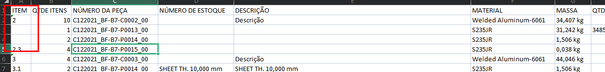<figcaption>
Imagem 01
</figcaption></figure>

### Solução

Reextrair a lista corrigida ou adicionar o índice manualmente, atenção para diferenciar entre peças e componentes.

***

## **Error CH02**

Matérial não encontrado.

Isso ocorre quando não é possível identificar o material porque a célula está em branco, como demonstrado na Imagem 02.

<figure>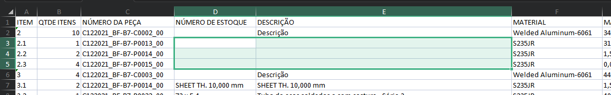<figcaption>
Imagem 02
</figcaption></figure>

### Solução

Reextrair a lista com correção, ou adicionar manualmente o matérial.

***

## Error CH03

Matérial não cadastrado.

Isso ocorre quando não é encontrado o Material na base de dados da Chloe, como demonstrado na Imagem 03.

<figure>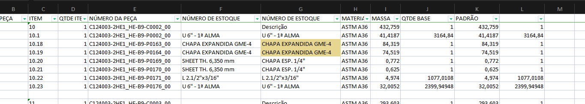<figcaption>
Imagem 03
</figcaption></figure>

### Solução

Prosseguir para próximas etapas, apenas atentar que Chloe na lista de material vai colocar esses matériais não cadastrado como ultimo da lista, e informar NULL e o [#error-ch14](erros-lista-de-material.md#error-ch14 "mention").

***

## Error CH04

Peso não encontrado.

Isso ocorre quando na coluna da **MASSA** aparece com célula em branco, como demonstrado na Imagem 04.

<figure>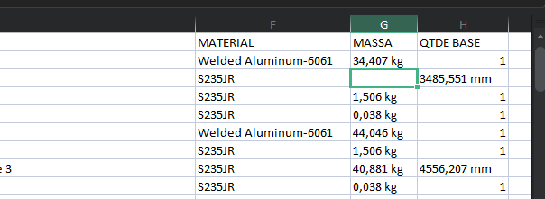<figcaption>
Imagem 04
</figcaption></figure>

### Solução

Reextrair a lista com correção, ou adicionar manualmente o peso.

***

## Error CH05

Massa com Libra.

Isso ocorre quando na coluna da massa aparece em Libra invés de Kilograma, como demonstrado na Imagem 05.

<figure>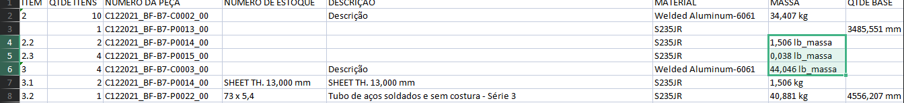<figcaption>
Imagem 05
</figcaption></figure>

### Solução

Rodar o  Script [arrumanumeroeunidadedapeca.md](../inventor/ilogic/arrumanumeroeunidadedapeca.md "mention") no modelo, e reextrair a lista com correção.

***

## Error CH06

QTDE não encontrado.

Isso ocorre quando a coluna de QTDE BASE está vazia, como demonstrado na Imagem 06.

<figure>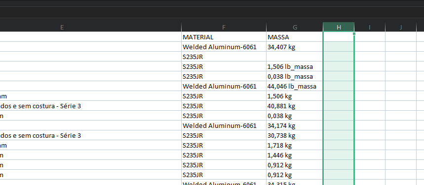<figcaption>
Imagem 06
</figcaption></figure>

### Solução

Reextrair a lista com correção.

***

## Error CH07

Componente com Descrição.

Componentes de uma peça devem ser identificados com materiais, como demostrado na Imagem 07.

<figure>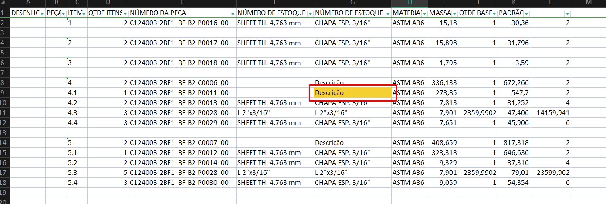<figcaption>
Imagem 07
</figcaption></figure>

### Solução

Depende de cada caso. Às vezes, trata-se apenas de um erro de modelo, como um redondo laminado que não teve o material de estoque atribuído. Em outros casos, são conjuntos de peças inseridas dentro de outras conjuntos de peças, o que pode exigir a modificação de toda a planilha.

***

## Error CH09

Peso da Peça não batendo com soma dos Componentes.

O peso da peça é calculado multiplicando o peso unitário do subcomponente pela quantidade, resultando no peso total da peça. Na Imagem 08, podemos observar que o item 2.5 está com o peso unitário incorreto, o que impacta o cálculo final.

<figure>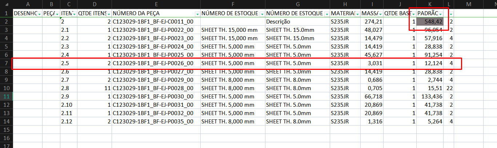<figcaption>
Imagem 08
</figcaption></figure>

### Solução

Existe diversãs solucções para esse erro, como células em branco, indicadas pelo [#error-ch04](erros-lista-de-material.md#error-ch04 "mention"), o peso estar em libras, resultando no erro [#error-ch05](erros-lista-de-material.md#error-ch05 "mention") ou em alguns casos, pode surgir o [#error-ch07](erros-lista-de-material.md#error-ch07 "mention") que surge modificações feitas na planilha para adaptar que não corrigidas.

***

## Error CH10

Peça sem código de projeto.

Isso ocorre em dois casos, quando é reutilizado peças de um projeto anterior, e exportado com códigos sem alteração. Em outros casos foi algum problema no modelo como na Imagem 09.

<figure>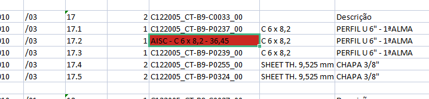<figcaption>
Imagem 09
</figcaption></figure>

### Solução 01

Rodar o  Script [arrumanumeroeunidadedapeca.md](../inventor/ilogic/arrumanumeroeunidadedapeca.md "mention") no modelo, e reextrair a lista com correção.

### Solução 02

Se for um modelo de outro projeto, será necessário renomear os arquivos.

***

## Error CH11

Elemento não cadastrado.

Ocorre quando a Chloe recebe um tipo Elemento/Material que ela ainda não tenha cadastrado em seu Banco de Dados, como exemplo a Imagem 10 com células destacas em laranja.

<figure>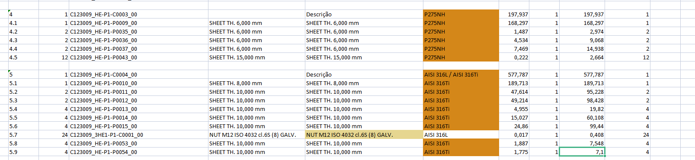<figcaption>
Imagem 10
</figcaption></figure>

### Solução

Prosseguir para próximas etapas, apenas atentar que Chloe na lista de material vai colocar esses matériais com elemento não cadastrado como ultimo da lista, e informar NULL e o [#error-ch14](erros-lista-de-material.md#error-ch14 "mention").

***

## Error CH12

Peso com Varia.

Quando o Inventor extrai uma lista, ele tenta simplificar com base no número da peça. No entanto, no caso da Imagem 11, mesmo que o código seja o mesmo, há algumas diferenças, como a presença de furos, o que resulta \*Varia_\*_ no peso.

<figure>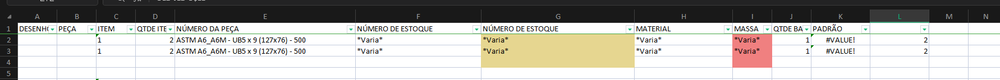<figcaption>
Imagem 11
</figcaption></figure>

### Solução

Rodar o  Script [arrumanumeroeunidadedapeca.md](../inventor/ilogic/arrumanumeroeunidadedapeca.md "mention") no modelo, e reextrair a lista com correção.

***

## Error CH13

Divergência no arredondamento do peso entre peças e a lista de material.

A soma dos pesos das peças tem que ser igual à da lista de materiais. Em caso de divergência, a aba da planilha será destacada em vermelho, como desmostrado na Imagem 12.

<figure>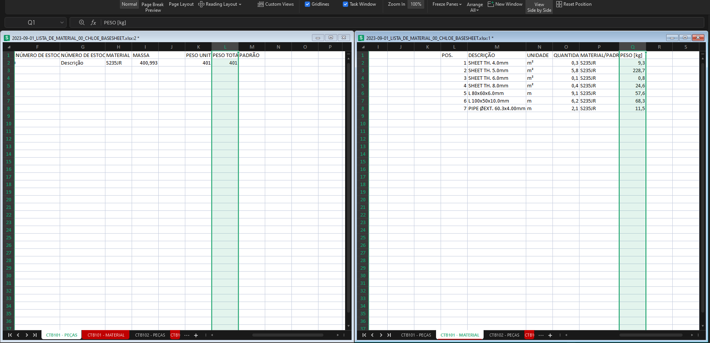<figcaption>
Imagem 12
</figcaption></figure>

### Solução 01

Adicione ou remova peso do material com a maior peso, a fim de alcançar o pesos das peças.

### Solução 02

Se houver uma discrepância muito grande, é necessário revisar a lista para identificar um possível erro.

***

## Error CH14

Este erro ocorre quando a Chloe tenta calcular a quantidade a partir do Peso correspondente, mas não consegue devido à ausência de alguma informação, a celula será pintada azul e escrito NULL, como demostrado na Imagem 13.

<figure>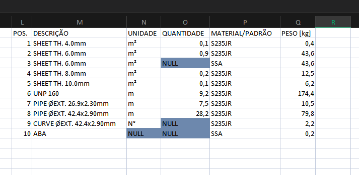<figcaption>
Imagem 13
</figcaption></figure>

### Solução

Se o item for comercial, será necessário inserir manualmente a quantidade correspondente. Caso ocorram os erros [#error-ch03](erros-lista-de-material.md#error-ch03 "mention") ou [#error-ch11](erros-lista-de-material.md#error-ch11 "mention"), será preciso fazer o cálculo manual para corrigir a situação.

***

## Alerta CL01

Material diferente de Aço Carbono.

O padrão a ser utilizado é S235JR ou ASTM-A36. E quando aparecer esse Alerta, é um indicativo de que algo incomum está ocorrendo. Por exemplo, já houve um caso em que um guarda-corpo foi enviado inteiramente em Inox AISI 304L, conforme mostrado na Imagem 14.

<figure>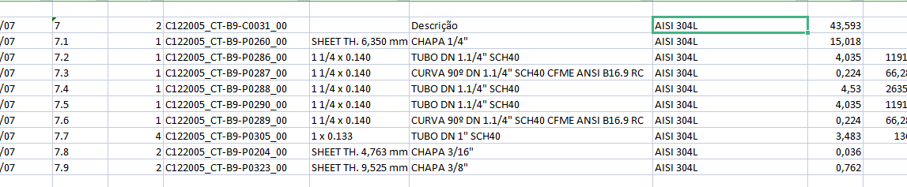<figcaption>
Imagem 14
</figcaption></figure>
