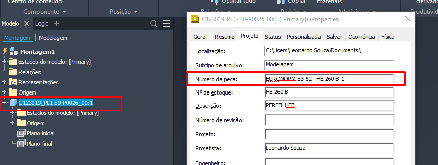
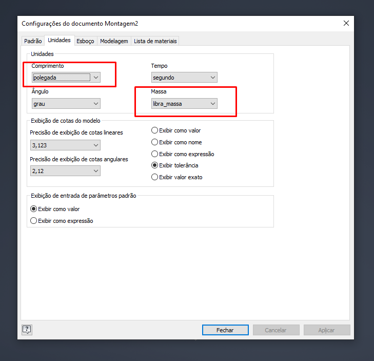

# ArrumaNumeroEUnidadeDaPeca

## Explicação

Passará por cada componente, verificando se o número da peça está igual nome do arquivo, atualizará comprimento para milímetro e a massa para kilograma, como demostrado na Imagem 01 e Imagem 02.

<figure><figcaption>
Imagem 01
</figcaption></figure>

<figure><figcaption>
Imagem 02
</figcaption></figure>
